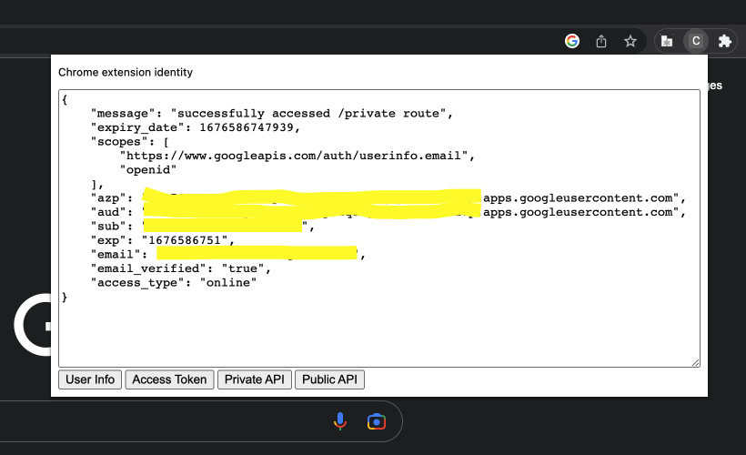

# Chrome extension identity

Demo of a simple auth flow starting from a Chrome extension to verifying identity with Google securely via a web server:
```
Chrome extension (chrome.identity)
    -> Server
        -> Google (OAuth2)
    <- Server
<- Chrome extension
```



## Getting started

### Google cloud setup
1. Create app and OAuth consent screen on Google Cloud on https://console.cloud.google.com/
2. Add OAuth screen test users (accounts you can login with)

### Server setup
1. Create a .env file in ./server and add variable from above GOOGLE_CLIENT_ID

### Chrome extension setup
1. Update manifest.json's oauth2.client_id to above
2. Enable devtools in extensions and load `/extension` unpacked


## Run

### Server
```
cd server
npm install
node app.js
```

## Auth flow

1. Get an `access_token` (`chrome.identity.getTokenInfo`)
2. Verify `access_token` via Google on server `client.getTokenInfo(access_token)`

